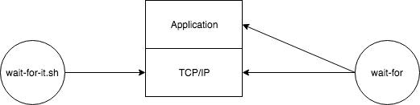

# wait-for
A Layer 7 (Application) aware way to detect when services are fully initialized.

## [Overview](https://medium.com/dm03514-tech-blog/ci-testing-remove-docker-initialization-race-conditions-96caa159bd86)
Reliable integration and service tests require accurately detecting when services are fully initialized before beginning test execution.  While solutions like wait-for-it.sh can reliably detect when services are listening and able to receive connections many services require a deeper check.  `wait-for` provides application specific detection for service initialization.



`wait-for` is useful in integration and service tests, where the test suite expects all services to be initialized before 
execution.  For many applications a TCP (level 4) initialization check isn't sufficient.  Services begin listening 
on sockets before they are fully initialized and able to begin performing work.

For example consider Hashicorp's [Vault](https://www.vaultproject.io/).  Upon startup it quickly begins to listen
so a wait-for-it.sh check would pass.  But true application level initialization can lag behind seconds after it begins
to listen, and necessitates an application level check:

```
EXPECTED="{\"initialized\":true,\"sealed\":false,\"standby\":false}"
VAULT_STATUS=$(curl -s http://127.0.0.1:8200/v1/sys/health | jq -r -j -S -c '{initialized, sealed, standby}')
until [ "$VAULT_STATUS" = "$EXPECTED" ]; do
     VAULT_STATUS=$(curl -s http://127.0.0.1:8200/v1/sys/health | jq -r -j -S -c '{initialized, sealed, standby}')
     echo "$SCRIPT polling vault status, expected: $EXPECTED received: $VAULT_STATUS"
     sleep 1
done
```

`wait-for` contains logic necessary to perform these application level checks.  Additionally, it offers the same
functionality as wait-for-it.sh by providing TCP/UDP based checks. `wait-for` also supports generic HTTP checks.

## Usage

```
$ ./wait-for
NAME:
   wait-for - wait for a service to become available

USAGE:
   wait-for [global options] command [command options] [arguments...]

VERSION:
   0.0.0

COMMANDS:
     http
     mysql
     postgres
     help, h   Shows a list of commands or help for one command

GLOBAL OPTIONS:
   --timeout value, -t value          duration to wait until marking as failure and returning (default: 5m0s)
   --poll-interval value, --pi value  interval (default: 100ms)
   --help, -h                         show help
   --version, -v                      print the version
```

## Quickstart HTTP

### Success

    ```
    $ ./wait-for http --url=http://google.com/
    {"level":"info","msg":"polling","time":"2018-08-26T00:50:39Z"}
    {"level":"debug","module":"poller.HTTP","msg":"http_response","status_code":200,"time":"2018-08-26T00:50:40Z"}
    
    $ echo $?
    0
    ```

### Timeout Reached

    ```
    $ ./wait-for -t 500ms http --url=http://www.google.com/1/2
    {"level":"info","msg":"polling","time":"2018-08-28T12:43:30Z"}
    {"level":"debug","module":"poller.HTTP","msg":"http_response","status_code":404,"time":"2018-08-28T12:43:30Z"}
    {"level":"info","msg":"polling","time":"2018-08-28T12:43:30Z"}
    {"level":"debug","module":"poller.HTTP","msg":"http_response","status_code":404,"time":"2018-08-28T12:43:30Z"}
    {"level":"info","msg":"polling","time":"2018-08-28T12:43:30Z"}
    {"level":"debug","module":"poller.HTTP","msg":"http_response","status_code":404,"time":"2018-08-28T12:43:31Z"}
    {"level":"info","msg":"polling","time":"2018-08-28T12:43:31Z"}
    {"level":"debug","module":"poller.HTTP","msg":"http_response","status_code":404,"time":"2018-08-28T12:43:31Z"}
    {"level":"info","msg":"polling","time":"2018-08-28T12:43:31Z"}
    {"level":"debug","module":"poller.HTTP","msg":"http_response","status_code":404,"time":"2018-08-28T12:43:31Z"}
    {"level":"info","msg":"polling","time":"2018-08-28T12:43:31Z"}
    {"level":"debug","module":"poller.HTTP","msg":"http_response","status_code":404,"time":"2018-08-28T12:43:31Z"}
    {"level":"info","msg":"timeout_reached","time":"2018-08-28T12:43:31Z"}
    {"level":"fatal","msg":"timeout reached: 500ms","time":"2018-08-28T12:43:31Z"}
    
    $ echo $?
    1
    ```

## Documentation Contents

### Protocols
- [HTTP](https://github.com/dm03514/wait-for/wiki/HTTP)
- [TCP/UDP](https://github.com/dm03514/wait-for/wiki/TCP-UDP)

### Applications
- [MySQL](https://github.com/dm03514/wait-for/wiki/MySQL)
- [Postgres](https://github.com/dm03514/wait-for/wiki/Postgres)
- [Redis](https://github.com/dm03514/wait-for/wiki/Redis)

